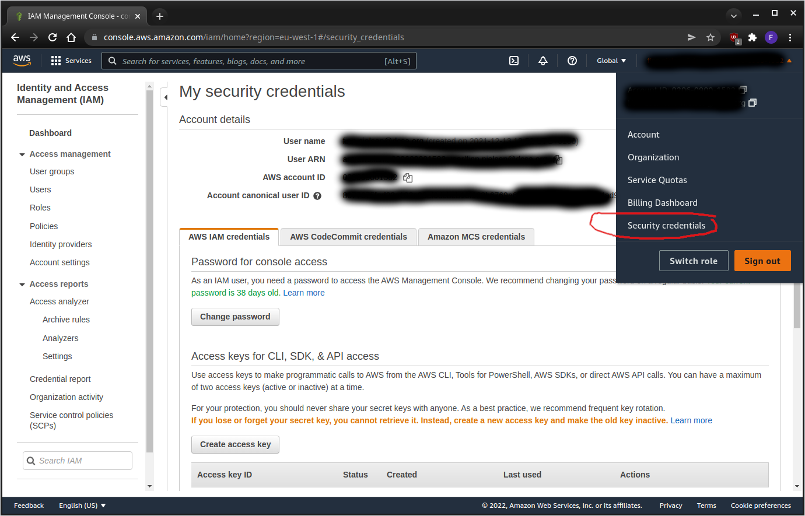
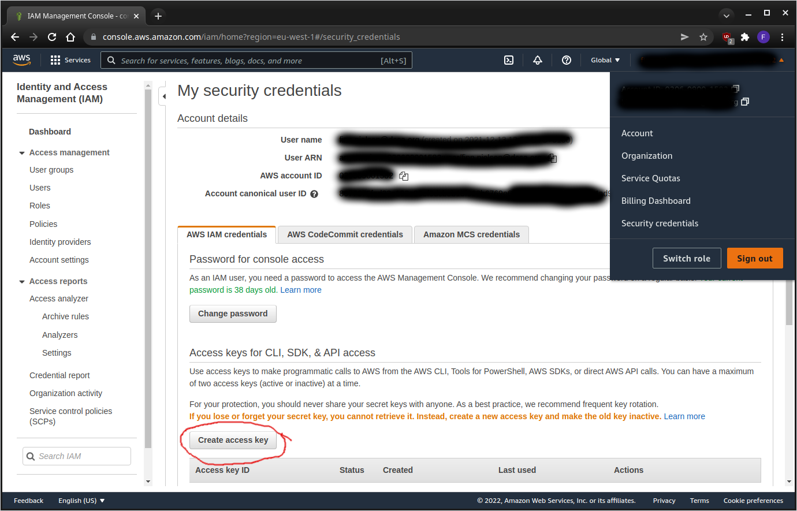
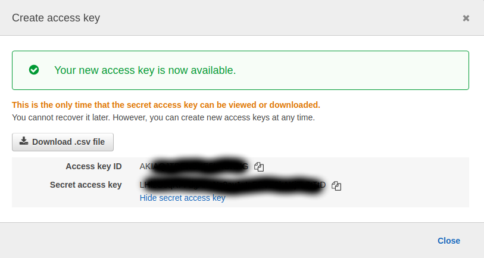

Developer Guide
==================================================================================================


## Prerequistes

* [Kubernetes tools](https://kubernetes.io/docs/tasks/tools/)
* [Helm](https://helm.sh/docs/intro/install/)
* [AWS-CLI](https://docs.aws.amazon.com/cli/latest/userguide/install-cliv2.html) and [AWS credentials](https://docs.aws.amazon.com/cli/latest/userguide/cli-configure-quickstart.html)
* Bash


### Creating AWS access key

To create an AWS access key and secret access key you need to follow a few simple steps.

Login to your Amazon account, then from the right side menu choose "Security credentials"



On the "My security credentials" page push the button "Create access key"



You should now get a pop up like this



The "Access key ID" and "Secret access key" are what you need.

Now you can either use the "aws configure" command or edit the AWS configuration files manually.

The result should look like this (with your access key and secret keys):

In $HOME/.aws/config:

```
[default]
region=eu-west-1
output=json

[profile dcsa-hamburg]
region=eu-west-1
output=json

[profile dcsa-valencia]
region=eu-west-1
output=json
```

In $HOME/.aws/credentials:

```
[default]
aws_access_key_id=********************
aws_secret_access_key=****************************************

[dcsa-hamburg]
aws_access_key_id=********************
aws_secret_access_key=****************************************

[dcsa-valencia]
aws_access_key_id=********************
aws_secret_access_key=****************************************
```

Note the difference in how to specify the profile between the two files if you are creating the files manually.

If you only have access to a single AWS account you will have only the default profile.


## Usage

